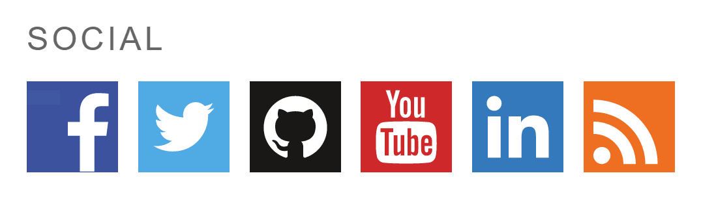

# kantoniak About Me Plugin

Plugin project intended to provide whole range of about widgets, shortcodes etc. Currently adds a list of social media buttons. Icons are scalable SVG, they work with any screen size and pixel density.

Currently supported sites: Facebook, Twitter, GitHub, YouTube, LinkedIn, RSS (a link).

  

## Features

* Widget with links to social media

## Installation

1. Copy contents to your `wp-content/plugins` directory or upload ZIP with repo contents via Wordpress admin (Plugins/Add new/Upload plugin).
1. In admin site, do to *Settings/About me*.
1. Fill in some links.
1. Save changes.
1. Add *About Me Social* widget somewhere.

## License

Copyright © 2017 Krzysztof Antoniak (http://antoniak.in/). Licensed under GNU General Public License, version 3.0 (GPL-3.0).

Original social media icons by [Allan McAvoy](https://allanmcavoy.com/), you can obtain EPS from [Dribble](https://dribbble.com/shots/1094936-Free-Flat-Social-Media-Icon-Set). Allan agreed to publish icons under GPL-3.0.
